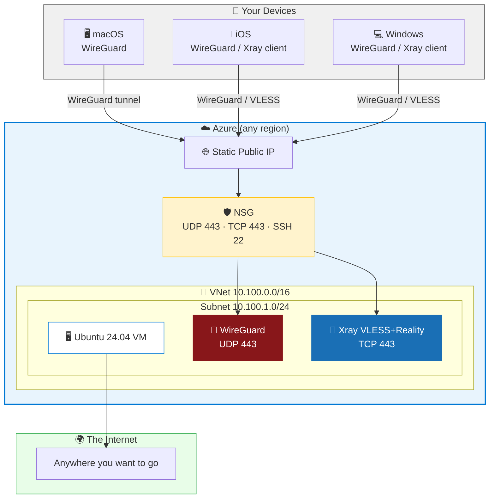

# 🛡️ VPNOnAzure

[](https://learn.microsoft.com/en-us/azure/azure-resource-manager/bicep/)
[](https://www.wireguard.com/)
[](https://github.com/XTLS/Xray-core)
[](LICENSE)
[]()
[]()

> **🚀 Your own VPN server on Azure, deployed in under 5 minutes.**

Tired of sketchy VPN providers that log everything, throttle you at peak hours, and vanish overnight? Build your own. This repo gives you a fully automated, infrastructure-as-code VPN server on Azure — WireGuard for raw speed, Xray VLESS+Reality for stealth when deep packet inspection fights back.

```
You ──► WireGuard (UDP 443) ──────────────────────► Azure VM ──► 🌍 The Open Internet
You ──► VLESS+Reality (TCP 443, disguised as TLS) ──► Azure VM ──► 🌍 The Open Internet
```

## 🤔 Why This Exists

- 🔒 **Privacy** — Your server, your keys, your logs (or lack thereof). Zero trust in third parties.
- 🧱 **Anti-censorship** — WireGuard on port 443 punches through most firewalls. When DPI kicks in, VLESS+Reality makes your traffic indistinguishable from regular HTTPS.
- ⚡ **Speed** — Direct path from Azure's global backbone. No shared bandwidth with 10,000 other users.
- 💰 **Cheap** — ~$12/mo for a B1s VM. Deallocate when idle, pay ~$5/mo. Less than most commercial VPN subscriptions.

## 🏗️ Architecture



## 🧰 The Stack

| Layer | Tech | Why |
|-------|------|-----|
| 🏗️ IaC | Azure Bicep | Declarative, native, no Terraform state file drama |
| ⚙️ Provisioning | cloud-init | VM boots with WireGuard already running |
| 🔐 VPN | WireGuard | ~3% overhead, kernel-space, auditable codebase |
| 🥷 Stealth | Xray VLESS+Reality | Defeats DPI — your packets cosplay as TLS 1.3 |
| 🚀 Deploy | Bash + `az` CLI | One script. No CI/CD. No YAML pipelines. Just `./deploy.sh` |

## ⚡ Quick Start

```bash
# 1️⃣ Clone it
git clone https://github.com/<your-username>/VPNOnAzure.git && cd VPNOnAzure

# 2️⃣ Configure (pick your region, VM size, peer count)
cp .env.example .env && $EDITOR .env

# 3️⃣ Generate WireGuard keypairs (Curve25519 — same crypto as Signal)
./scripts/generate-keys.sh

# 4️⃣ Ship it to Azure
az login
cd infra && ./deploy.sh

# 5️⃣ Generate client configs (+ QR codes if qrencode is installed)
cd .. && ./scripts/generate-client-configs.sh

# 6️⃣ Import configs/peer1.conf into WireGuard app. Done. 🎉
```

**⏱️ Time from `git clone` to connected VPN: ~5 minutes.** Most of that is Azure provisioning the VM.

## 🔧 Configuration

Everything lives in `.env`. No YAML. No JSON. Just `KEY=value`.

```bash
RESOURCE_GROUP=rg-vpn           # Azure resource group name
LOCATION=eastus                 # Azure region (see all: az account list-locations -o table)
VM_SIZE=Standard_B2s            # B1s ($8/mo) or B2s ($30/mo) — your call
PEER_COUNT=6                    # Number of client devices
WG_PORT=443                     # Port 443 = looks like HTTPS = harder to block
DNS_SERVERS="1.1.1.1, 8.8.8.8" # Cloudflare + Google DNS
```

See [`.env.example`](.env.example) for all options including SSH key path, SSH IP restriction, and DNS labels.

## 🔄 Day-to-Day

```bash
./scripts/vm-start.sh            # ▶️  Wake up the VM (billing resumes)
./scripts/vm-stop.sh             # ⏹️  Deallocate (billing stops, IP retained)

ssh azureuser@<ip> 'sudo wg'    # 👀 Check connected peers and transfer stats

./scripts/generate-client-configs.sh   # 🔄 Regenerate after IP change
```

## 💰 Cost Breakdown

| | B1s (budget) | B2s (comfortable) |
|---|---|---|
| 🖥️ Compute | ~$8/mo | ~$30/mo |
| 🌐 Static IP | ~$4/mo | ~$4/mo |
| 💾 Disk (30 GB) | ~$1/mo | ~$1/mo |
| **✅ Total (always on)** | **~$13/mo** | **~$35/mo** |
| **😴 Total (deallocate at night)** | **~$9/mo** | **~$20/mo** |

> 💡 Pro tip: `vm-stop.sh` deallocates the VM. You pay $0 for compute while it's off. Only storage + IP continue billing.

## 🥷 Stealth Mode: Xray VLESS+Reality

WireGuard is fast but its handshake pattern is fingerprint-able. If your network does deep packet inspection:

1. SSH into your VM
2. Install [Xray-core](https://github.com/XTLS/Xray-core)
3. Configure VLESS+Reality on TCP 443
4. Connect via any Xray-compatible client

Your traffic looks like a regular TLS 1.3 connection to a legitimate website. DPI sees a real certificate and a normal handshake. Good luck blocking that without breaking half the internet. 😏

> 🚧 Automating Xray in cloud-init is on the TODO list. PRs welcome.

## 🔀 Split Tunneling (Optional)

By default, **all traffic** goes through the VPN (full tunnel). To route only specific traffic through the tunnel, you can customize `AllowedIPs` in the generated client configs.

A helper script is included that fetches [APNIC](https://www.apnic.net/) delegation data to compute country-level IP exclusions:

```bash
python3 scripts/generate-china-routes.py    # Fetches APNIC data, computes exclusion routes
./scripts/generate-client-configs.sh        # Regenerates configs with split tunnel AllowedIPs
```

> ⚠️ **iOS caveat:** WireGuard on iOS can't handle large route tables (>100 entries). Stick with full tunnel on iOS devices.

## 📱 Client Setup

| Platform | App | Guide |
|----------|-----|-------|
| 🖥️ macOS | [WireGuard](https://apps.apple.com/us/app/wireguard/id1451685025) | [setup-macos.md](clients/setup-macos.md) |
| 📱 iOS | [WireGuard](https://apps.apple.com/us/app/wireguard/id1441195209) | [setup-ios.md](clients/setup-ios.md) |
| 💻 Windows | [WireGuard](https://www.wireguard.com/install/) | [setup-windows.md](clients/setup-windows.md) |

📲 `brew install qrencode` on your Mac — the config generator will spit out terminal QR codes you can scan directly with your phone.

## 📁 Project Structure

```
.env.example                     # cp to .env, fill in your values
infra/
  deploy.sh                      # 🔴 The big red button
  main.bicep                     # Bicep orchestrator
  cloud-init.yaml                # VM bootstrap — WireGuard ready on first boot
  modules/{vm,vnet,publicip,nsg}.bicep
scripts/
  generate-keys.sh               # 🔑 Curve25519 keypairs + preshared keys
  generate-client-configs.sh     # 📄 .conf files + QR codes
  generate-china-routes.py       # 🗺️  APNIC data → AllowedIPs exclusion
  vm-start.sh / vm-stop.sh      # ▶️⏹️ Billing on / billing off
clients/
  setup-{macos,ios,windows}.md   # 📖 Per-platform walkthroughs
```

## 📋 Prerequisites

- [Azure CLI](https://learn.microsoft.com/en-us/cli/azure/install-azure-cli) — `brew install azure-cli` / `winget install Microsoft.AzureCLI`
- [WireGuard tools](https://www.wireguard.com/install/) — `brew install wireguard-tools` / `sudo apt install wireguard-tools`
- An Azure subscription ([free account](https://azure.microsoft.com/en-us/free/) works, or use [Visual Studio Enterprise credits](https://azure.microsoft.com/en-us/pricing/member-offers/credit-for-visual-studio-subscribers/))
- An SSH key — `ssh-keygen -t ed25519` if you don't have one

## 🔐 Security

- 🚫 **No passwords anywhere.** SSH is key-only. WireGuard is public-key + preshared key.
- 🎯 **Minimal attack surface.** NSG allows exactly 3 ports. Everything else is dropped.
- 🙈 **No secrets in git.** Keys and configs are generated locally, never committed.
- 🔒 **Optional IP restriction.** Set `ALLOW_SSH_FROM` in `.env` to lock SSH to your IP.

## ⚠️ Known Limitations

| Issue | Workaround |
|-------|------------|
| 🧱 DPI may throttle WireGuard | Switch to VLESS+Reality |
| 📱 iOS can't handle split tunnel routes | Use full tunnel (`0.0.0.0/0`) on iOS |
| 🚧 Xray not yet automated | Manual install post-deploy (automation planned) |

## 🤝 Contributing

Found a bug? Want to automate Xray setup? PRs are welcome. The codebase is intentionally simple — Bash scripts, Bicep modules, no frameworks.

## 📄 License

[MIT](LICENSE) — Do whatever you want with it.

---

<p align="center">
  <i>Built with 🔧 Bicep, 🐚 Bash, and a healthy distrust of third-party VPN providers.</i>
</p>
